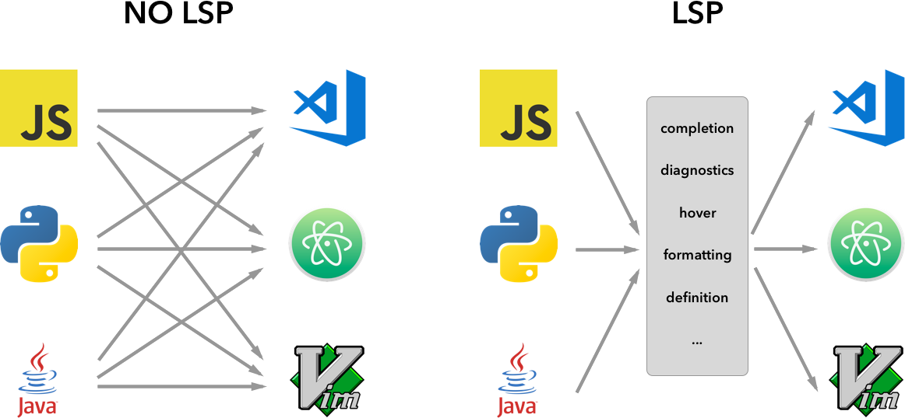
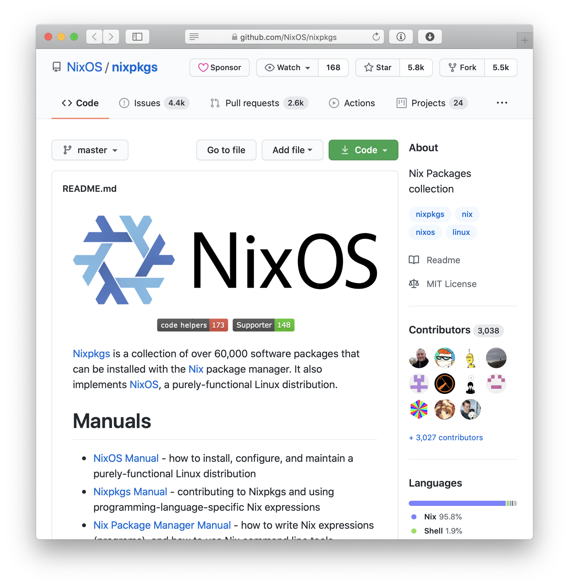

build-lists: false
slidenumbers: true

[.header: alignment(center), Avenir Next]

<br>
<br>

## Language Server for the Nix Expression Language

<br>
<br>

_Author:_ Kostyuchenko Ilya

---

> Nix is a powerful package manager that makes package management reliable and reproducible.
-- [nixos.org](https://nixos.org)

---

# Nix

- Package manager
- Build system*
- Ad hoc development environments
- Easy (cross-community) dependency management
- Reproducible builds
- *And much more: NixOS, NixOps, Build Caching, Docker ...*

---

# Nix Expression Language

```nix
let pkgs = import ./nixpkgs {};
in derivation {
  name = "simple";
  builder = "${pkgs.bash}/bin/bash";
  args = [ ./simple_builder.sh ];
  gcc = pkgs.gcc;
  coreutils = pkgs.coreutils;
  src = ./simple.c;
  system = builtins.currentSystem;
}
```

---

[.build-lists: true]

# Project scope

1. Develop a type system (and type checker)
2. Develop a Language Server

---

# Language Server Protocol



---

# The Nix Ecosystem

The central repository contains more than 60000 packages.



---

# Existing approaches

Type systems for functional languages is an actively researched field.

The Hindley–Milner type system_[1]_ is a simple, but well-studied type system for a very simple language. It is fully decidable, does not require annotations. It is the basis for many real-world type systems.

---

# Methods and algorithms

The type system will be heavily influenced by the Hindley–Milner_[1]_ type system.

The type system will implement arbitrary-ranked polymorphism_[3]_ with deep instantiation to disambiguate types in existing untyped code.

The type system will allow the user to influence type checking by providing explicit type annotations._[4]_

---

# Methods and algorithms

The system will use the Shake build system to manage dependencies and caches._[3]_

---

# Expected results

1. An executable of the Nix expression language server with an integrated type checker.
2. A suite of automated tests to check some of the language server functionality.

---

[.text: text-scale(0.7)]

# References

1. Damas L., Milner R. Principal type-schemes for functional programs //Proceedings of the 9th ACM SIGPLAN-SIGACT symposium on Principles of programming languages. – 1982. – С. 207-212.
2. Mitchell N. Shake before building: replacing make with haskell //ACM SIGPLAN Notices. – 2012. – Т. 47. – №. 9. – С. 55-66.
3. Jones S. P. et al. Practical type inference for arbitrary-rank types //Journal of functional programming. – 2007. – Т. 17. – №. 1. – С. 1-82. MLA
4. Stuckey P. J., Sulzmann M., Wazny J. Improved inference for checking type annotations //arXiv preprint cs/0507036. – 2005. MLA
