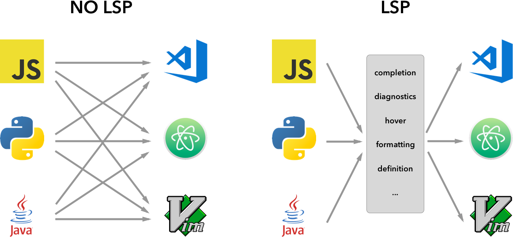
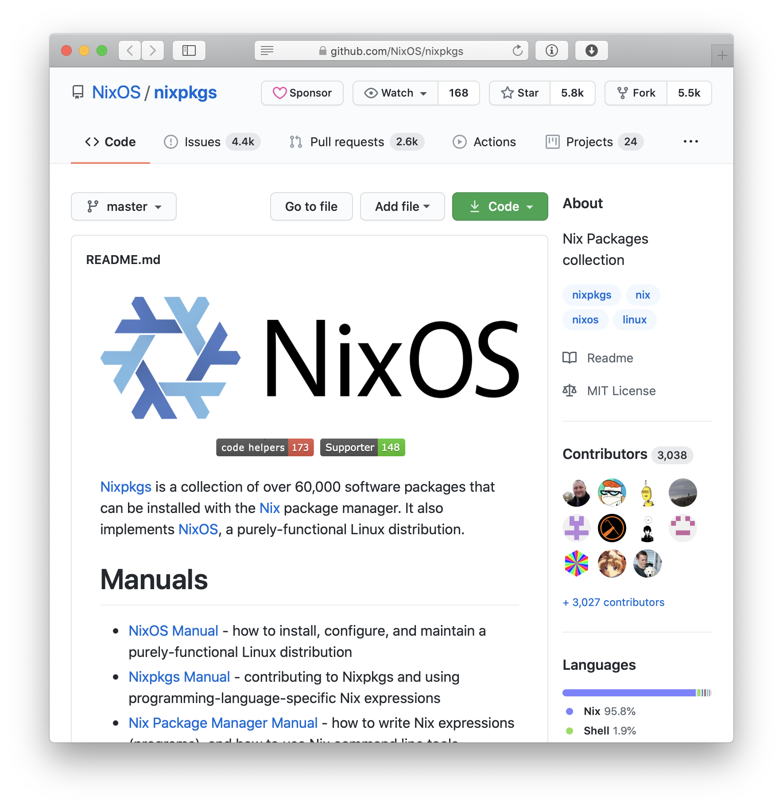

build-lists: true
slidenumbers: true

[.header: alignment(center), Avenir Next]

## Языковой сервер для Nix Expression Language

## Language Server for the Nix Expression Language

<br>

_Автор:_ Костюченко Илья Игоревич

_Руководитель:_ Кулямин Виктор Вячеславович, Доцент, базовая кафедра "Системное программирование"

---

> Nix is a powerful package manager that makes package management reliable and reproducible.
-- [nixos.org](https://nixos.org)

---

# Nix

- Package manager
- Build system*
- Ad hoc development environments
- Easy (cross-community) dependency management
- Reproducible builds
- *And much more: NixOS, NixOps, Build Caching, Docker ...*

---

# Nix Expression Language

- Purely functional
  - No shared mutable state
  - Easy to reason about
  - Easy reuse
- Lazy
- Strict, but not static typing

---

# Nix Expression Language

```nix
let pkgs = import ./nixpkgs {};
in derivation {
  name = "simple";
  builder = "${pkgs.bash}/bin/bash";
  args = [ ./simple_builder.sh ];
  gcc = pkgs.gcc;
  coreutils = pkgs.coreutils;
  src = ./simple.c;
  system = builtins.currentSystem;
}
```

---

# Language Server Protocol

The Language Server Protocol (LSP) defines the protocol used between an editor or IDE and a language server that provides language features like autocomplete, go to definition, find all references etc.

---

# Language Server Protocol



---

[.text: text-scale(0.85)]

# Terms and definitions

**Type system** – a logical system comprising a set of rules that assigns a property called a type to the various constructs of a computer program

**Type checking** – the process of verifying and enforcing the constraints of types.

**Hindley–Milner type system** – a classical type system for the lambda calculus with parametric polymorphism.

**Language Server** – a service for analyzing code in a specific language which can be used in many code editors.

---

# Relevance

The Nix ecosystem is slowly becoming popular.

The central repository contains more than 60000 packages.

There is a need to make writing Nix expressions less error-prone.



---

# The goal

1. Develop a type system for the existing Nix expression language
2. Develop a type checker for the type system
3. Develop a Language server for the Nix expression language integrating the type checker

---

# Existing approaches

Type systems for functional languages is an actively researched field.

The Hindley–Milner type system_[1]_ is a simple, but well-studied type system for a very simple language. It is fully decidable, does not require annotations. It is the basis for many real-world type systems.

---

# Existing solutions

## Type systems

- github.com/regnat/ptyx – Abandoned and incomplete.
- github.com/regnat/tix – An older version of ptyx. Abandoned, terribly incomplete.
- github.com/haskell-nix/hnix – has a module with a type checker. Is very experimental and is not used.

---

# Existing solutions

## Language servers

- github.com/nix-community/rnix-lsp/ – Basic goto and error reporting. No type system, extremely simple.
- github.com/nix-community/vscode-nix-ide – Basic instantiation error reporting. (`nix-instantiate`)

---

# Functional requirements

- The system should perform type checking for expression.

- The system should analyze conditional statements where the condition consists only of type checks and boolean operators built into the Nix expression language.

- The system should analyze the types and presence of attributes in attribute sets.

- The system should report encountered typechecking.

---

# Functional requirements

- The system should provide the location of definitions for all locally used terms .

- The system should report the use of undefined terms through means defined by the Language Server Protocol.

- The system should report the types of requested expressions through means defined by the Language Server Protocol.

---

# Functional requirements

- The system should provide code completions suggestions from the variables currently in scope and expressions built into the language.

- The system should provide a way for the programmer to explicitly annotate types of expressions which will influence type checking.

---

# Methods and algorithms

The type system will be heavily influenced by the Hindley–Milner_[1]_ type system.

The type system will implement arbitrary-ranked polymorphism_[3]_ with deep instantiation to disambiguate them in existing untyped code.

The type system will allow the user to influence type checking by providing explicit type annotations._[4]_

---

# Methods and algorithms

The system will use the Shake build system to manage dependencies and caches._[3]_

---

# Used tools

1. Haskell
2. Nix
3. Visual Studio Code
4. Haskell Language Server
5. Haskell Stack

---

# Used libraries

1. hnix – Nix expression language parsing, will need to be forked
2. shake
3. acts – semigroup actions

---

# Expected results

1. An executable of the Nix expression language server with an integrated type checker.
2. A suite of automated tests to check some of the language server functionality.

---

[.text: text-scale(0.7)]

# References

1. Damas L., Milner R. Principal type-schemes for functional programs //Proceedings of the 9th ACM SIGPLAN-SIGACT symposium on Principles of programming languages. – 1982. – С. 207-212.
2. Mitchell N. Shake before building: replacing make with haskell //ACM SIGPLAN Notices. – 2012. – Т. 47. – №. 9. – С. 55-66.
3. Jones S. P. et al. Practical type inference for arbitrary-rank types //Journal of functional programming. – 2007. – Т. 17. – №. 1. – С. 1-82. MLA
4. Stuckey P. J., Sulzmann M., Wazny J. Improved inference for checking type annotations //arXiv preprint cs/0507036. – 2005. MLA
