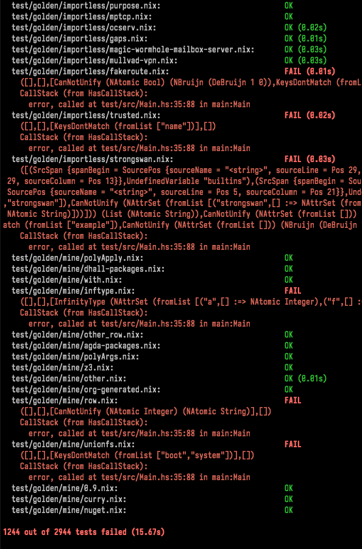

build-lists: true
slidenumbers: true
footer: Kostyuchenko Ilya, Static analyzer for the Nix Expression Language

[.header: alignment(center), Avenir Next]


## Static analyzer for the Nix Expression Language

### Статический анализатор для Nix Expression Language

<br>
<br>

_Author:_ Kostyuchenko Ilya

_Supervisor:_ Victor Kuliamin, Associate Professor, PhD

#### _Source code:_ [github.com/ilyakooo0/tix](https://github.com/ilyakooo0/tix)

---

## Nix is a powerful package manager that makes package management reliable and reproducible.

#### – [nixos.org](https://nixos.org)

---

[.build-lists: false]

# Nix

- Package manager
- Build system*
- Ad hoc development environments
- Easy (cross-community) dependency management
- Reproducible builds
- *And much more: NixOS, NixOps, Build Caching, Docker ...*

---

[.build-lists: false]

# Nix Expression Language

[.column]

- Purely functional
- Lazy
- **Strict, but not static typing**

[.column]

```nix
let pkgs = import ./nixpkgs {};
in derivation {
  name = "simple";
  builder = "${pkgs.bash}/bin/bash";
  args = [ ./simple_builder.sh ];
  gcc = pkgs.gcc;
  coreutils = pkgs.coreutils;
  src = ./simple.c;
  system = builtins.currentSystem;
}
```

---

[.text: text-scale(0.75)]

# Terms and definitions

**Type system** – a logical system comprising a set of rules that assigns a property called a type to the various constructs of a computer program

**Type checking** – the process of verifying and enforcing the constraints of types.

**Hindley–Milner type system** – a classical type system for the lambda calculus with parametric polymorphism.

**Parametric polymorphism** – a type of polymorphism where types are specified by abstract symbols that can represent any type.

**Row polymorphism** – a kind of polymorphism that allows one to write programs that are polymorphic on record field types.

---

# Relevance

The Nix ecosystem is slowly becoming popular.

The central repository contains more than 60000 packages.

There is a need to make writing Nix expressions less error-prone.


---

# Relevance

Nix Expression Language: **Strict, but not static typing**.

Adding static typing would:

- Increase reliability of code
- Lower costs of development (resolving issue earlier is cheaper)

<!-- _The typechecker should help find issues in existing code_ -->

---

# The goal

1. Develop a static type system for the existing Nix expression language
2. Develop a type checker for this static type system

---

# Existing typecheckers

- github.com/regnat/ptyx – Abandoned and incomplete.
- github.com/regnat/tix – An older version of ptyx. Abandoned, terribly incomplete.
- github.com/haskell-nix/hnix – has a module with a type checker. Is very experimental and is not used.

---

# Existing approaches

Type systems for functional languages is an actively researched field.

The Hindley–Milner type system_[1]_ is a simple, but well-studied type system for a very simple language. It is fully decidable, does not require annotations. It is the basis for many real-world type systems.

---

# Methods and algorithms

The developed type system is heavily influenced by the Hindley–Milner_[1]_ type system.


---

# Methods and algorithms

The developed type system supports parametric polymorphism to support code that does not require a specific type.

```nix
x: y: x ++ y
```

```
∀ α. [α] -> [α] -> [α]
```

---

# Methods and algorithms

The developed type system implements row polymorphism to work with attribute sets.

```nix
x: x.v + 69
```

```
∀ α. (α.v = Number) => α -> Number
```

<br />

```nix
x: x // {v = "hello";}
```

```
∀ α β. (α // {v = String;} ~ β) => α -> β
```

---

[.build-lists: false]

# Used tools

1. Haskell
2. Visual Studio Code
3. Haskell Language Server
4. Haskell Stack

---

# Implementation

The typechecker is implemented in a two-step architecture:

1. Inferring the types of terms and collecting constraints
2. Solving the collected constraints

---

# Results

- Theoretical
  - A static type system for the Nix Expression Language

- Practical

  - A typechecker executable that successfully typechecks _most_ of the selected files from _nixpkgs_.

  - The typechecker supports all language constructs.



---

# Potential future developments

- Add support for user-supplied type annotations.
- Type holes
- Language Server Integration
- Better type rendering
- Sum types

---

[.build-lists: false]
[.text: text-scale(0.7)]

# References

1. L. Damas and R. Milner, “Principal type-schemes for functional pro- grams,” in Proceedings of the 9th ACM SIGPLAN-SIGACT symposium on Principles of programming languages, 1982, pp. 207–212.
2. E. Dolstra and A. Lo ̈h, “Nixos: A purely functional linux dis- tribution,” in Proceedings of the 13th ACM SIGPLAN international conference on Functional programming, 2008, pp. 367–378.
3. J. G. Morris and J. McKinna, “Abstracting extensible data types: or, rows by any other name,” Proceedings of the ACM on Programming Languages, vol. 3, no. POPL, pp. 1–28, 2019.
4. D. Leijen, “Extensible records with scoped labels.” Trends in Functional Programming, vol. 6, pp. 179–194, 2005.

---

# Demonstration

---

## Parametric polymorphism

```nix
let f = x: y: { a = x; b = y + 1;}; in f
```

```
∀ α. α -> Integer -> {a = α; b = Integer;}
```

---

## Parametric polymorphism

```nix
let f = x: y: { a = x; b = y + 1;}; in f
```

```
∀ α. α -> Integer -> {a = α; b = Integer;}
```

<br>

```nix
let f = x: y: { a = x; b = y + 1;}; in f "hello" 42
```

```
{a = String; b = Integer;}
```

---

## Row-polymorphism with _attribute sets_

```nix
let f = x: x.a; in f
```

```
∀ α β. (α.a = β) => α -> β
```

---


## Row-polymorphism with _attribute sets_

```nix
let f = x: x.a; in f
```

```
∀ α β. (α.a = β) => α -> β
```

<br>

```nix
let f = x: x.a; in f {a = 1; b = "hello";}
```

```
Integer
```

---

## Row-polymorphism with _attribute sets_

```nix
let f = x: x.a; in f
```

```
∀ α β. (α.a = β) => α -> β
```

<br>

```nix
let f = x: x.a; in f {a = "1"; b = "hello";}
```

```
String
```

---

## Row-polymorphism with _attribute sets_

```nix
let f = x: x.a; in f
```

```
∀ α β. (α.a = β) => α -> β
```

<br>

```nix
let f = x: x.a; in f {b = "hello";}
```

```
Error: key "a" not present in { b = String; }
```

---

## Row-polymorphism with _attribute sets_

```nix
let f = x: x // {a = 69;}; in f
```

```
∀ α β. (α // {a = Integer;} ~ β) => α -> β
```

---

## Row-polymorphism with _attribute sets_

```nix
let f = x: x // {a = 69;}; in f
```

```
∀ α β. (α // {a = Integer;} ~ β) => α -> β
```

<br>

```nix
let f = x: x // {a = 69;}; in f {a = "hello"; b = "world";}
```

```
{a = Integer; b = String;}
```

---

## Row-polymorphism with _attribute sets_

```nix
let f = x: x // {a = 69;}; in f
```

```
∀ α β. (α // {a = Integer;} ~ β) => α -> β
```

<br>

```nix
let f = x: x // {a = 69;}; in f {}
```

```
{a = Integer;}
```
